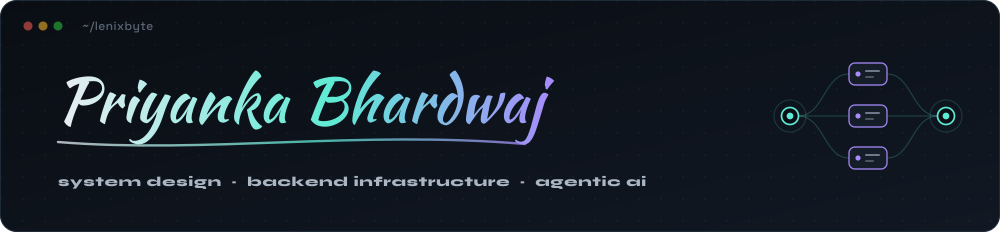
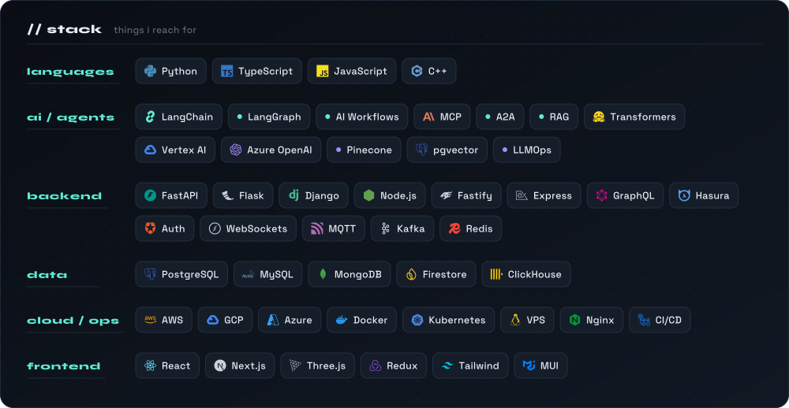
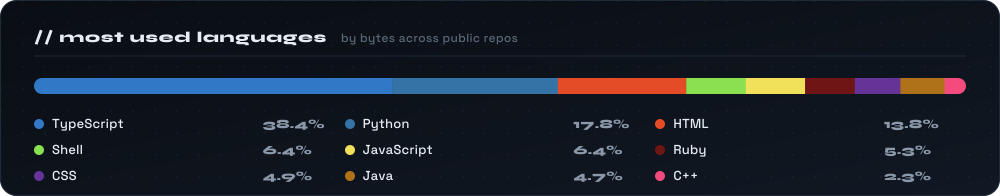

  

  
  
  
  

---

### 👩‍💻 About

- 🏗️ Backend engineer working on **backend infrastructure, system design and agentic workflows**
- 🤖 Building **multi-agent systems** — orchestration with LangChain / LangGraph, tool use, shared context
- 🔎 **RAG pipelines** over pgvector and Pinecone, tuned for what comes back rather than how much
- ⚡ Low-latency services with **FastAPI, WebSockets, MQTT and Redis** — devices, apps and models in real time
- 💸 **LLMOps** — caching and parallelised inference; ~30% off operating cost on one production system
- 🧭 Leading backend architecture, code reviews and mentoring
- 🛠️ Side of the desk: **developer tooling** — a VS Code extension for Google ADK, and a CLI for juggling GitHub accounts
- 📫 Reach me — **lenixbyte@icloud.com**

---

### 🛠️ Stack

  

---

### 🚀 Featured Work

|  |  |
| --- | --- |
| **[ADK Tools](https://github.com/lenixbyte/adk-tools)** — VS Code extension ([marketplace](https://marketplace.visualstudio.com/items?itemName=lenixbyte.adk-tools) · [open vsx](https://open-vsx.org/extension/lenixbyte/adk-tools)) | Scaffold, run, debug, visualise, eval and deploy Google ADK agents without leaving the editor |
| **[sgh](https://github.com/lenixbyte/sgh)** — shell CLI | A different GitHub account in every terminal — per-terminal `gh` profiles for bash, zsh and fish |
| **[camaud](https://github.com/lenixbyte/camaud)** — Python PoC | Replaces the audio track of a video with an AI-generated voice |
| **[Code Evaluation Platform](https://gitlab.com/python-react-evaluation)** | Dockerised engine that runs and grades Python / JavaScript submissions in isolation |
| **[Battery Health Analyser](https://github.com/lenixbyte/BatteryAnalyser)** | Data-driven analytics for cell- and pack-level battery health |
| **[Armok](https://github.com/Armokite)** | 6-DOF Arduino pick-and-place robotic arm — firmware and control |

---

### 📊 Stats

  

<!-- commit + streak counts are quiet right now — uncomment when they're worth showing

  
  

-->

---

### 🏆 Highlights

- Co-organised **NECTF**, a jeopardy-style CTF with 400+ hackers from 25+ countries, as one of two core organisers

---

### 🔗 Connect

  
  
  
  

  
  

  

chess · problem solving · sports · hindi &amp; english · bangalore, india

